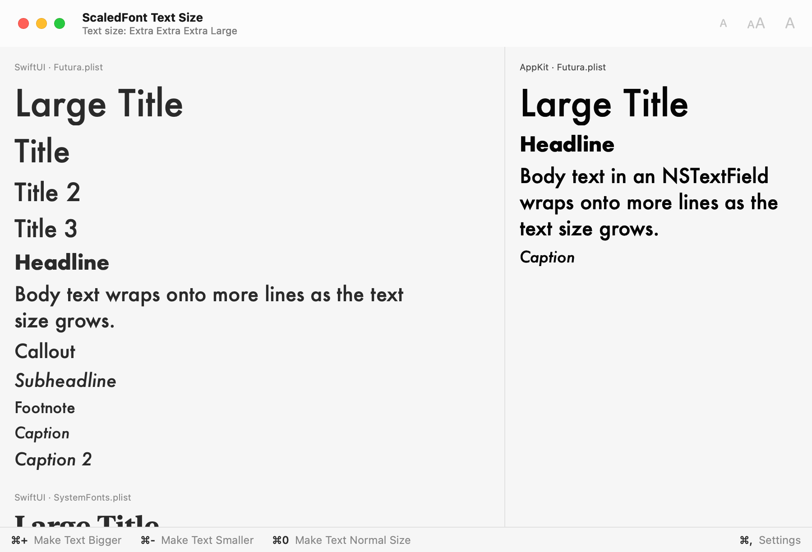

# ScaledFont - Custom Fonts With Dynamic Type

[](https://swiftpackageindex.com/gewill/ScaledFont)
[](https://swiftpackageindex.com/gewill/ScaledFont)

**A utility type to help you use custom fonts with dynamic type, on iOS, iPadOS, tvOS, watchOS, visionOS and macOS.**

This is a fork of [ScaledFont by Keith Harrison](https://github.com/kharrison/ScaledFont) that adds macOS support, including a text size setting for Mac apps, and system fonts in the style dictionary. See [What This Fork Adds](#what-this-fork-adds), and read the [documentation on the Swift Package Index](https://swiftpackageindex.com/gewill/ScaledFont/documentation).

<picture>
  <source media="(prefers-color-scheme: dark)" srcset="Sources/ScaledFont/ScaledFont.docc/Resources/typical-text-sizes~dark@2x.png">
  
</picture>

## What This Fork Adds

This fork continues from version 1.0.5 of the upstream project and adds:

- **macOS support.** `font(forTextStyle:)` takes an `NSFont.TextStyle` and returns an `NSFont`, and the SwiftUI modifiers work as they do on the other platforms. See [macOS Support](#macos-support).
- **An in-app text size for Mac apps.** macOS has no Dynamic Type, so `TextSizePreference` stores the text size people choose in your app, and ScaledFont scales its fonts to that size with the steps of Dynamic Type on iOS.
- **System fonts in the style dictionary.** An entry without `fontName` and `fontSize` describes a system font, with a `design` key (`default`, `serif` or `monospaced`) and a `weight` key (`regular` or `bold`). The `weight` key works for custom fonts too.
- **Variants where you use a font.** `font(forTextStyle:design:weight:)` and `scaledFont(_:design:weight:)` override the variants of the style dictionary.
- **Documentation** for UIKit, AppKit and SwiftUI on every platform, with articles on the style dictionary, the font variants and the in-app text size.

It does not include the changes of upstream versions 1.0.6 and 1.0.7: compatibility with strict Swift concurrency checking, the removal of the `LibraryContentProvider`, and changes to the Swift tools version. The [changelog](CHANGELOG.md) lists every change.

## macOS Support

ScaledFont supports Mac apps that use AppKit or SwiftUI, with the same style dictionaries and the same API as on the other platforms:

| | iOS, iPadOS, tvOS, watchOS and visionOS | macOS |
| --- | --- | --- |
| Fonts | `UIFont` for a `UIFont.TextStyle`, from iOS 11, tvOS 11 and watchOS 4 | `NSFont` for an `NSFont.TextStyle`, from macOS 11 |
| SwiftUI | The `scaledFont(_:)` modifiers, from iOS 13, tvOS 13 and watchOS 6 | The same modifiers, from macOS 11 |
| Text size | Dynamic Type | A text size that your app offers with `TextSizePreference`, from macOS 12 |

macOS has no Dynamic Type. The text size in the accessibility settings of macOS changes only the Apple apps listed there, and apps cannot read it through a public API. So, by default, a custom font keeps the size from the style dictionary, and a text style without an entry uses the macOS system font for that style.

To let people make the text in your Mac app larger or smaller, offer a text size setting with `TextSizePreference`. ScaledFont then scales the fonts it manages with the same steps and the same text style hierarchy as Dynamic Type on iOS, up to the largest accessibility size. See [In-App Text Size on macOS](#in-app-text-size-on-macos), and try the `TextSizeDemo` app in the `Examples` folder.

The system text styles of macOS are smaller than those of iOS: body text is 13 points instead of 17. A style dictionary has the same sizes on every platform, so a Mac app may want a style dictionary of its own, with the macOS sizes from the typography specifications of the [Apple Human Interface Guidelines](https://developer.apple.com/design/human-interface-guidelines/typography#Specifications).

## Installation

Add the package with the Swift Package Manager, from the URL of this fork:

```swift
dependencies: [
    .package(url: "https://github.com/gewill/ScaledFont.git", from: "1.1.1")
],
targets: [
    .target(name: "MyApp", dependencies: [
        .product(name: "ScaledFont", package: "ScaledFont")
    ])
]
```

In Xcode, choose File > Add Package Dependencies and enter `https://github.com/gewill/ScaledFont`.

## Why ScaledFont

Dynamic type is an **essential iOS feature** that allows the user to choose their preferred text size. Fully supporting dynamic type with a custom font requires two things:

1. Define a base font with a suitable font weight and size for each of the possible text styles at the Large (Default) content size.
2. Scale the base font across the range of dynamic type content sizes.

For the first step, you might want to start with the specifications in the typography section of the [Apple Human Interface Guidelines](https://developer.apple.com/design/human-interface-guidelines/typography#Specifications), which list the sizes Apple uses for the system font on each platform.

For example, here I'm creating a bold Noteworthy font at 17 points as the base headline font and a light version of the font for the base body font:

```swift
let headlineFont = UIFont(name: "Noteworthy-Bold", size: 17)
let bodyFont = UIFont(name: "Noteworthy-Light", size: 17)
```

For the second step, it's been possible since iOS 11 to scale a base font for the user's chosen dynamic type size using font metrics:

```swift
let headMetrics = UIFontMetrics(forTextStyle: .headline)
headlineLabel.font = headMetrics.scaledFont(for: headlineFont)

let bodyMetrics = UIFontMetrics(forTextStyle: .body)
bodyLabel.font = bodyMetrics.scaledFont(for: bodyFont)
```

The problem, if you do this for every text style you use, is that you end up with those font metrics spread all over your app. That's both difficult to maintain and hard to keep consistent when you want to make design changes.

**TIP: Don't forget when using UIKit labels, text fields and text views to enable automatic adjustments when the user changes their preferred content size:**

```swift
label.adjustsFontForContentSizeCategory = true
```

## Style Dictionary

To make it easier to manage the base font metrics for all of the possible text styles the `ScaledFont` type collects them into a style dictionary. You store the style dictionary as a property list file that, by default, you include in the main bundle.

The style dictionary contains an entry for each text style. The available text styles are:

- `largeTitle`, `title`, `title2`, `title3`
-  `headline`, `subheadline`, `body`, `callout`
-  `footnote`, `caption`, `caption2`

For a custom font, the value of each entry is a dictionary with two keys:

+ `fontName`: A `String` which is the font name.
+ `fontSize`: A number which is the point size to use at the `.large` (base) content size.

For example, to use a 17 pt Noteworthy-Bold font for the `.headline` style at the `.large` content size:

```
<dict>
  <key>headline</key>
  <dict>
    <key>fontName</key>
    <string>Noteworthy-Bold</string>
    <key>fontSize</key>
    <integer>17</integer>
  </dict>
</dict>
```

For a system font, omit `fontName` and `fontSize` and use the optional variant keys:

+ `design`: `default`, `serif` or `monospaced`
+ `weight`: `regular` or `bold`

For example, to use a serif system font for the `.subheadline` style:

```
<dict>
  <key>subheadline</key>
  <dict>
    <key>design</key>
    <string>serif</string>
  </dict>
</dict>
```

Unsupported variant values are ignored and the normal system font is used. A
custom font entry needs both `fontName` and `fontSize`; if either one is
missing the whole style dictionary is ignored.

You can also override the style dictionary at the call site:

```swift
Text("Metadata")
  .scaledFont(.subheadline, design: .serif, weight: .bold)
```

Call-site variants take precedence over the style dictionary. Supplying a
`design` uses the matching system font design for that view when the entry
does not specify `fontName`; use `design: .default` to go back to the normal
system font. Supplying `weight` applies that weight to the system font, so
`weight: .regular` undoes a `bold` from the style dictionary. For custom font
entries, `weight: .bold` uses the bold face of the same font family when the
family has one that keeps the other style traits, such as italic or condensed;
otherwise it keeps the configured `fontName`.

You do not need to include an entry for every text style but if you try to use a text style that is not included in the dictionary it will fallback to the system preferred font.

If you are not sure what font names to use you can print all available names with this code snippet:

```swift
let families = UIFont.familyNames
families.sorted().forEach {
  print("\($0)")
  let names = UIFont.fontNames(forFamilyName: $0)
  print(names)
}
```

On macOS, list the font families and their fonts with `NSFontManager`:

```swift
let manager = NSFontManager.shared
manager.availableFontFamilies.sorted().forEach { family in
  print(family)
  let names = manager.availableMembers(ofFontFamily: family)?.compactMap { $0.first as? String } ?? []
  print(names)
}
```

## Example Style Dictionaries

See the `Examples` folder included in this package for some examples:

+ `Futura` uses a font that is built into iOS, tvOS, watchOS and macOS.
+ `Noteworthy` uses a font that is built into iOS and macOS.
+ `NotoSerif` needs the font files from [Google fonts](https://fonts.google.com/specimen/Noto+Serif). Add them to your application target, and list them under "Fonts provided by application" in the `Info.plist` file of the target.
+ `SystemFonts` uses no custom font. It sets the serif and monospaced designs and a bold weight for the system font.

<picture>
  <source media="(prefers-color-scheme: dark)" srcset="Sources/ScaledFont/ScaledFont.docc/Resources/example-style-dictionaries~dark@2x.png">
  
</picture>

The folder also contains `TextSizeDemo`, a macOS app that shows the in-app text size. See [In-App Text Size on macOS](#in-app-text-size-on-macos).

**Check the license for any fonts you plan on shipping with your application.**

## Using A ScaledFont - UIKit

When using `UIKit` you apply the scaled font to the text label, text field or text view in code. You need a minimum deployment target of iOS 11 or later. 

1. Create the `ScaledFont` by specifying the name of the style dictionary. Add the style dictionary to the main bundle along with any custom fonts you are using:

    ```swift
    let scaledFont = ScaledFont(fontName: "Noteworthy")
    ```

2. Use the `font(forTextStyle:)` method of the scaled font when setting the font of any text labels, fields or views: 

    ```swift
    let label = UILabel()
    label.font = scaledFont.font(forTextStyle: .headline)
    ```

3. Remember to set the `adjustsFontForContentSizeCategory` property to have the font size adjust automatically when the user changes their preferred content size:

    ```swift
    label.adjustsFontForContentSizeCategory = true
    ```

## Using A ScaledFont - AppKit

When using `AppKit` you apply the scaled font to the text field or text view in code. You need a minimum deployment target of macOS 11 or later.

1. Create the `ScaledFont` by specifying the name of the style dictionary. Add the style dictionary to the main bundle along with any custom fonts you are using:

    ```swift
    let scaledFont = ScaledFont(fontName: "Noteworthy")
    ```

2. Use the `font(forTextStyle:)` method of the scaled font when setting the font of any text fields or views:

    ```swift
    let textField = NSTextField(labelWithString: "Headline")
    textField.font = scaledFont.font(forTextStyle: .headline)
    ```

macOS does not have Dynamic Type, so a custom font keeps the size from the style dictionary, and a text style without an entry uses the macOS system font for that style. To let people change the text size in your app, see [In-App Text Size on macOS](#in-app-text-size-on-macos).

## Using A ScaledFont - SwiftUI

When using SwiftUI you create the scaled font and add it to the environment of a view. You then apply the scaled font using a view modifier to any view in the view hierarchy. You need a minimum deployment target of iOS 13, tvOS 13, watchOS 6 or macOS 11 or later to use SwiftUI.

1. Create the `ScaledFont` by specifying the name of the style dictionary. Add the style dictionary to the main bundle along with any custom fonts you are using:

    ```swift
    let scaledFont = ScaledFont(fontName: "Noteworthy")
    ```

2. Apply the scaled font to the environment of a view. This might typically be the root view of your view hierarchy:

    ```swift
    ContentView()
    .environment(\.scaledFont, scaledFont)
    ```

3. Apply the scaled font view modifier to a view containing text in the view hierarchy:

    ```swift
    Text("Headline")
    .scaledFont(.headline)
    ```

On macOS 12 and later, the modifiers scale their fonts for the `dynamicTypeSize` of the environment, which your app sets. See [In-App Text Size on macOS](#in-app-text-size-on-macos).

**Note: A SwiftUI view presented in a sheet does not inherit the environment of the presenting view**. If you want to use a scaled font in the presented view you will need to pass it in the environment:

```swift
struct ContentView: View {
  @Environment(\.scaledFont) private var scaledFont
  @State private var isShowingSheet = false
  
  var body: some View {
    Button("Present View") {
        isShowingSheet = true
    }
    .sheet(isPresented: $isShowingSheet) {
        SheetView()
        .environment(\.scaledFont, scaledFont)
    }
  }
}
```

## In-App Text Size on macOS

macOS does not share the text size people choose in System Settings with other apps, and SwiftUI ignores the Dynamic Type size for fonts on the Mac. To let people make the text in your app larger, offer your own text size setting. ScaledFont scales the fonts it manages to that size, with the same steps and the same text style hierarchy as Dynamic Type on iOS. You need macOS 12 or later. The in-app text size is not in a release yet; to use it, depend on the `main` branch.

`TextSizePreference` stores the size in the user defaults of your app, keeps it within a range, which includes every accessibility size by default, and tells your app when it changes.

With SwiftUI, set the size on your view hierarchy with the `dynamicTypeSize(_:)` modifier. The `scaledFont(_:)` modifiers read it and scale their fonts:

```swift
@main
struct ReaderApp: App {
  @StateObject private var textSize = TextSizePreference()
  private let scaledFont = ScaledFont(fontName: "Noteworthy")

  var body: some Scene {
    WindowGroup {
      ContentView()
        .scaledFont(scaledFont)
        .dynamicTypeSize(textSize.dynamicTypeSize)
    }
    .commands {
      CommandGroup(after: .toolbar) {
        Button("Make Text Bigger") { textSize.increase() }
          .keyboardShortcut("+")
        Button("Make Text Smaller") { textSize.decrease() }
          .keyboardShortcut("-")
        Button("Make Text Normal Size") { textSize.reset() }
          .keyboardShortcut("0")
      }
    }
  }
}
```

With AppKit, pass the size when you get a font, and set the fonts again when the preference changes, because AppKit does not adjust fonts by itself:

```swift
func applyFonts() {
  label.font = scaledFont.font(forTextStyle: .body, dynamicTypeSize: textSize.dynamicTypeSize)
}

func observeTextSize() {
  NotificationCenter.default.addObserver(
    self,
    selector: #selector(textSizeDidChange(_:)),
    name: TextSizePreference.didChangeNotification,
    object: textSize
  )
}

@objc func textSizeDidChange(_ notification: Notification) {
  applyFonts()
}
```

A custom font scales by the factor `UIFontMetrics` applies to it on iOS, and a system font by the ratio of the iOS preferred font sizes, both rounded to whole points as on iOS. At the default Large size the fonts are exactly the ones you get without a size.

To try it, run the demo app in the `Examples` folder:

```sh
cd Examples
swift run TextSizeDemo
```

<picture>
  <source media="(prefers-color-scheme: dark)" srcset="Sources/ScaledFont/ScaledFont.docc/Resources/text-size-demo~dark@2x.png">
  
</picture>

The "Offering an In-App Text Size" article in the documentation of the package shows every text style at every size.

## Further Reading

The [documentation of this package](https://swiftpackageindex.com/gewill/ScaledFont/documentation) is on the Swift Package Index.

The following blog posts on [useyourloaf.com](https://useyourloaf.com) provide more details:

+ [Using A Custom Font With Dynamic Type](https://useyourloaf.com/blog/using-a-custom-font-with-dynamic-type/)
+ [Scaling Custom SwiftUI Fonts With Dynamic Type](https://useyourloaf.com/blog/scaling-custom-swiftui-fonts-with-dynamic-type/)
